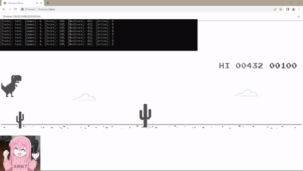
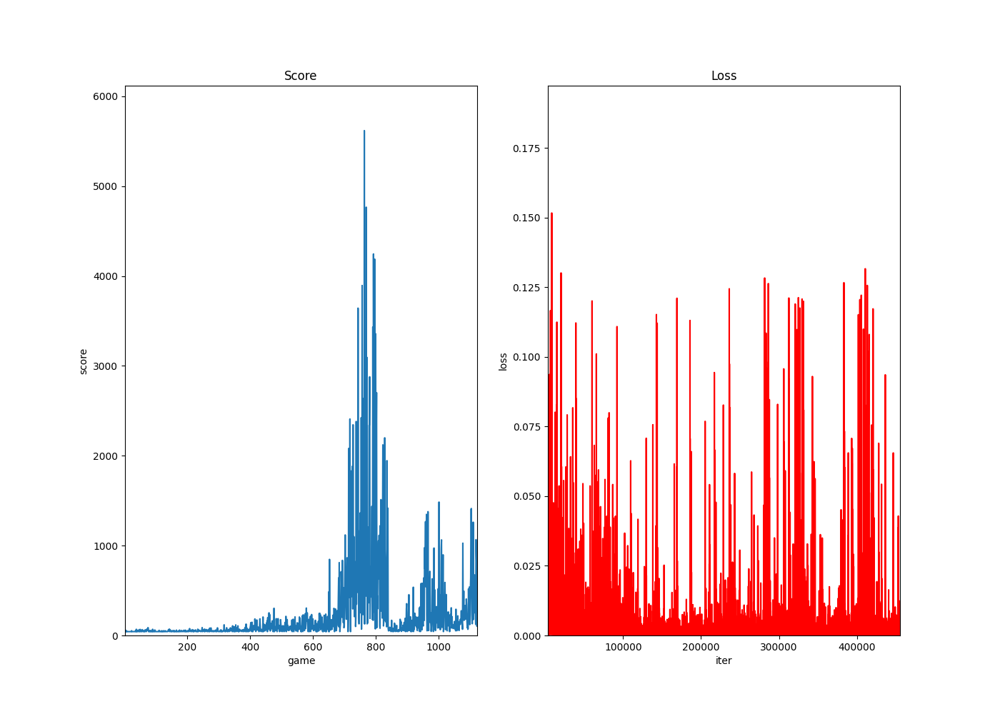
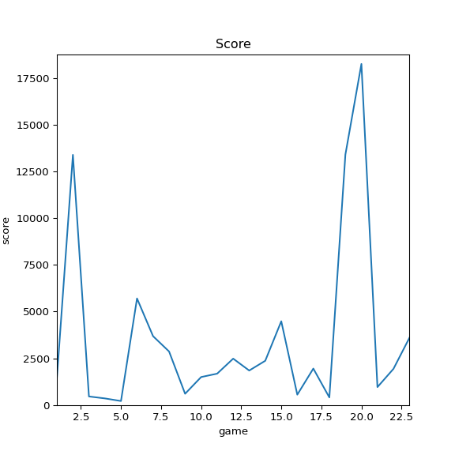

# DQN算法训练AI玩Chrome恐龙游戏

## 开发环境

•**Python 3.9.16**

•**PyTorch** **1.13.1**

•**cuda** **12.0**

•Chrome 113.0.5672.127

•selenium 4.9.1

•opencv-python 4.7.0.72

•argparse

•matplotlib

•numpy

## 文件目录

```
│  agent.py
│  controller.py
│  dinorun.py
│  model.py
│  chromedriver.exe
│  QDNdino.pptx
│  README.md
├─ assets
├─ checkpoints
├─ pic
│  ├─plot
│  └─screenshot
```

## 运行方式

在安装好的环境中，运行以下指令：

```
python dinorun.py --mode train
```

进行训练。

```
python dinorun.py --mode test
```

用模型文件 `checkpoints\best-checkpoint.pth`进行测试，不会对模型进行修改。

```
python dinorun.py --resume
```

用模型文件 `checkpoints\best-checkpoint.pth`继续上次训练。

```
python dinorun.py --help
```

获取输入帮助。

**P.S.**

`checkpoints`文件夹中有已经训练好的`best-checkpoint.pth`和`checkpoint.pth`，请选用2开头的版本并修改文件名以使用。

**注意：**

如果`webdriver`报错，需要安装`chromedriver`，前往https://chromedriver.storage.googleapis.com/index.html下载`Chrome`对应版本的`chromedriver`，添加至`Chrome.exe`同级目录和`Python`或`Anaconda`下的`Script`目录，并添加环境变量。

一般情况下无需此操作，因为新版本的`selenium`会自动安装`chromedriver`。

**血的教训：如果用Anaconda运行，一定要关浏览器而不是Anaconda，否则图画不出来！**

## 运行示例（测试模式）



训练数据：



测试数据（目前最高分**18270**）：



## 参考项目

https://github.com/dexhunter/DeepLearningTRexRush

https://github.com/Paperspace/DinoRunTutorial

https://github.com/CharlesPikachu/AIGames/tree/master/AITRexRush
